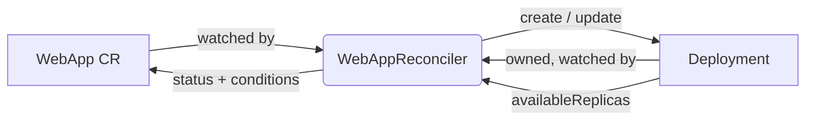

# webapp-operator

[](go.mod)
[](LICENSE)

A Kubernetes operator that manages a `WebApp` custom resource, reconciling each one into a standard `Deployment`.
Declare just an image, a replica count, and a port, and the operator runs and scales a container-based web application for you.

It is built with [Kubebuilder](https://book.kubebuilder.io/) and [controller-runtime](https://github.com/kubernetes-sigs/controller-runtime), and is meant as a compact, readable reference for how a custom resource maps onto built-in workload objects.

## Overview

`WebApp` (API group `apps.example.com/v1`) is a thin, opinionated abstraction over a Kubernetes `Deployment`.
Instead of authoring and maintaining a full `Deployment` spec, you declare only the three fields that matter for a simple web workload:

| Field      | Required | Default | Description                                  |
| ---------- | -------- | ------- | -------------------------------------------- |
| `image`    | yes      | -       | The container image to run.                  |
| `replicas` | no       | `1`     | The desired number of Pod replicas.          |
| `port`     | no       | `8080`  | The container port the application listens on. |

A minimal `WebApp` looks like this:

```yaml
apiVersion: apps.example.com/v1
kind: WebApp
metadata:
  name: webapp-sample
spec:
  image: nginx:1.25
  replicas: 2
  port: 80
```

## How it works

The controller watches `WebApp` objects and continuously reconciles the cluster toward the declared state.



For each `WebApp`, the reconcile loop:

1. Builds the desired `Deployment` (same name and namespace) and sets the `WebApp` as its controller owner, so deleting the `WebApp` garbage-collects the `Deployment`.
2. Creates the `Deployment` if it does not exist.
3. Otherwise compares the live `Deployment` against the desired spec and updates it when the replica count or container image has drifted.
4. Mirrors the `Deployment`'s available replica count into `status.availableReplicas` and sets an `Available` condition (`True` once the desired replicas are available, `False` while they are not).

Because the controller `Owns` the `Deployment`, any change to the `Deployment` also re-triggers reconciliation, keeping the two in sync.
Status is written back only when it actually changes, avoiding needless API writes on no-op reconciles.

Once installed, the custom columns make the state visible at a glance:

```console
$ kubectl get webapps
NAME            IMAGE        REPLICAS   AVAILABLE   AGE
webapp-sample   nginx:1.25   2          2           30s
```

## Getting started

### Prerequisites

- Go v1.24+
- Docker v17.03+
- kubectl v1.11.3+
- A Kubernetes cluster (a local [kind](https://kind.sigs.k8s.io/) cluster works well)

### Run locally against a cluster

This is the fastest way to try the operator.
It installs the CRD and runs the controller on your machine against the cluster in your current kubeconfig context.

```sh
# 1. Install the WebApp CRD into the cluster.
make install

# 2. Run the controller locally (Ctrl-C to stop).
make run
```

In a second terminal, create a `WebApp` and watch the operator act on it:

```sh
# Apply the sample WebApp.
kubectl apply -k config/samples/

# The operator creates a Deployment of the same name.
kubectl get webapps
kubectl get deployments

# Scale it by editing the WebApp; the Deployment follows.
kubectl patch webapp webapp-sample --type=merge -p '{"spec":{"replicas":4}}'
kubectl get deployment webapp-sample -w

# Delete the WebApp; its Deployment is garbage-collected via the owner reference.
kubectl delete webapp webapp-sample
kubectl get deployments
```

### Deploy to a cluster

Build and push the manager image, then deploy it:

```sh
# Build and push the image to a registry you control.
make docker-build docker-push IMG=<some-registry>/webapp-operator:tag

# Install the CRD and deploy the controller manager.
make install
make deploy IMG=<some-registry>/webapp-operator:tag
```

To tear everything down:

```sh
make undeploy
make uninstall
```

## Development

Common workflows are driven through the `Makefile`; run `make help` for the full list.

| Command             | Description                                                        |
| ------------------- | ----------------------------------------------------------------- |
| `make manifests`    | Regenerate CRDs and RBAC from `+kubebuilder` markers.             |
| `make generate`     | Regenerate `DeepCopy` methods.                                    |
| `make test`         | Run unit and integration tests against a local envtest control plane. |
| `make test-e2e`     | Run end-to-end tests against a Kind cluster.                      |
| `make lint`         | Run `golangci-lint` (builds a custom binary with the configured plugins). |
| `make run`          | Run the controller locally against your current kube context.    |
| `make build`        | Build the manager binary into `bin/`.                            |

### Tests

The controller tests run against [envtest](https://book.kubebuilder.io/reference/envtest.html), a real API server and etcd without a full cluster, and cover:

- Creating a `Deployment` owned by the `WebApp` with the desired spec.
- Applying default replica count and port when the spec omits them.
- Reconciling replica-count and image drift back to the desired state.
- Mirroring available replicas and setting the `Available` condition.
- Handling a reconcile for a `WebApp` that no longer exists.

```sh
make test
```

## Project layout

```
api/v1/                       WebApp API types and generated DeepCopy code.
cmd/main.go                   Manager entrypoint.
internal/controller/          WebAppReconciler and its tests.
config/                       Kustomize bases: CRD, RBAC, manager, samples, etc.
test/e2e/                     End-to-end tests.
```

## License

Licensed under the Apache License, Version 2.0.
See [LICENSE](LICENSE) for details.
